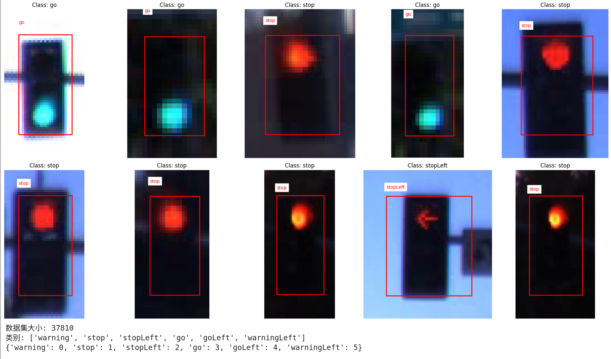

# 交通信号灯分类器


这个项目实现了一个基于ROS2的交通信号灯分类系统。它使用深度学习模型对输入的交通信号灯图像进行分类，并发布分类结果。

## 特性

- 使用ResNet18作为基础模型进行交通信号灯分类
- 支持实时图像处理和分类
- 提供调试模式，可输出带标签的图像用于验证
- 可选择性地在结果图像上绘制分类结果
- 高准确率：在验证集上达到99.75%的准确率

## 安装

### 前提条件

- ROS2 Humble
- Python 3.8+
- PyTorch 1.9+
- OpenCV 4.5+

### 安装步骤

1. 克隆本仓库到您的ROS2工作空间的`src`目录：

   ```bash
   cd ~/ros2_ws/src
   git clone https://github.com/your_username/traffic_light_classifier.git
   ```

2. 安装依赖：

   ```bash
   cd ~/ros2_ws
   rosdep install --from-paths src --ignore-src -r -y
   ```

3. 编译工作空间：

   ```bash
   colcon build --symlink-install
   ```

4. 源化环境：

   ```bash
   source ~/ros2_ws/install/setup.bash
   ```

## 使用方法

### 分类器节点（生产用途）

1. 运行分类器节点（不绘制结果）：

   ```bash
   ros2 run traffic_light_classifier classification_node
   ```

2. 运行分类器节点（绘制结果）：

   ```bash
   ros2 run traffic_light_classifier classification_node --ros-args -p plot_result:=true
   ```

分类器节点订阅 `/perception/traffic_light_recognition/traffic_light_image` 话题，期望接收裁剪好的交通信号灯图像（sensor_msgs/Image类型）。分类结果将发布到 `/perception/traffic_light_recognition/traffic_class` 话题（std_msgs/String类型）。如果启用了绘图功能，带有分类结果的图像将发布到 `/perception/traffic_light_recognition/traffic_light_result_image` 话题。

#### Result Topic Msg Format
   ```python
        # 发布分类结果
        result_msg = String()
        result_msg.data = f'Predicted: {predicted_label}'
        if true_label:
            result_msg.data += f', True: {true_label}'
        self.result_publisher.publish(result_msg)
    ```
#### Labels


```json
{'warning': 0, 'stop': 1, 'stopLeft': 2, 'go': 3, 'goLeft': 4, 'warningLeft': 5}
```


### 相机节点（测试用途）

相机节点用于测试目的，它从LISA数据集中随机选择图像并发布。

1. 配置LISA数据集路径：

   打开 `traffic_light_classifier/traffic_light_classifier/cam_node.py` 文件，修改以下路径：

   ```python
   annotations_dir = '/path/to/your/Annotations/Annotations/dayTrain'
   data_dir = '/path/to/your/dayTrain/dayTrain'
   ```

2. 运行相机节点（默认模式）：

   ```bash
   ros2 run traffic_light_classifier cam_node
   ```

3. 运行相机节点（调试模式）：

   ```bash
   ros2 run traffic_light_classifier cam_node --ros-args -p debug_mode:=true
   ```

## 数据集和模型

- 本项目使用LISA交通信号灯数据集的dayTrain部分进行训练。
- 模型在验证集上达到了99.75%的准确率。
- 目前未使用的数据集部分：daySequence1, daySequence2, nightTrain, nightSequence1, nightSequence2, sample-nightClip1。

## 调试

要使用RViz2进行可视化调试：

1. 启动RViz2：

   ```bash
   rviz2
   ```

2. 在RViz2中，添加Image显示，并设置话题为 `traffic_light_result_image`。

3. 运行分类器节点和相机节点（如上所述）。

现在，您应该能够在RViz2中看到带有分类结果的图像。
